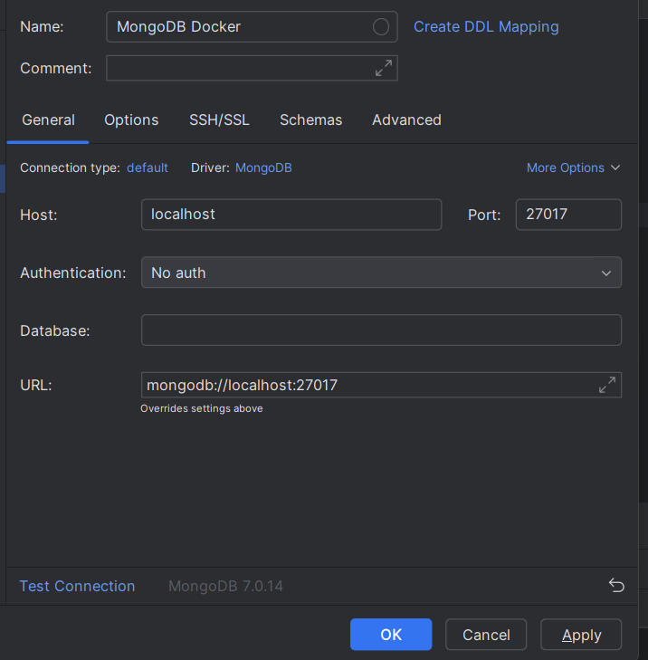

# **Caso Práctico: Sitios Web de Comercio Electrónico**

## Descripción:
Los sitios web de comercio electrónico, como **Amazon**, gestionan una gran cantidad de datos variados y en constante cambio. Uno de los principales desafíos es el **catálogo de productos**, que incluye miles o incluso millones de artículos, cada uno con diferentes características, descripciones, precios, especificaciones técnicas, imágenes y comentarios de usuarios. La estructura de estos productos es muy diversa, ya que cada categoría de producto puede tener atributos únicos. Por ejemplo, un televisor podría tener especificaciones como tamaño de pantalla, resolución y tipo de panel, mientras que una prenda de ropa podría tener atributos como talla, color y material.


## Solución con el Modelo Relacional de tablas:
El modelo relacional de bases de datos se basa en la organización de la información en **tablas** (o relaciones) con **esquemas rígidos**. Cada tabla tiene un conjunto de columnas (campos) predefinidas, donde cada columna representa un atributo de la entidad que la tabla almacena. En un sitio de comercio electrónico como Amazon, intentar modelar un catálogo de productos en una base de datos relacional podría estructurarse de la siguiente manera:

1. **Tabla Productos**:
   - **IDProducto** (clave primaria)
   - **Nombre**
   - **Descripción**
   - **Precio**
   - **CategoríaID** (clave foránea de la tabla Categorías)

2. **Tabla Categorías**:
   - **IDCategoría** (clave primaria)
   - **NombreCategoría**
   - **DescripciónCategoría**

3. **Tabla EspecificacionesProducto** (para almacenar atributos variables, según categoría):
   - **IDEspecificación** (clave primaria)
   - **IDProducto** (clave foránea de la tabla Productos)
   - **NombreEspecificación**
   - **ValorEspecificación**

4. **Tabla ImágenesProducto**:
   - **IDImagen** (clave primaria)
   - **IDProducto** (clave foránea de la tabla Productos)
   - **URLImagen**

5. **Tabla ComentariosProducto**:
   - **IDComentario** (clave primaria)
   - **IDProducto** (clave foránea de la tabla Productos)
   - **Comentario**
   - **Calificación**
   - **FechaComentario**

6. **Tabla Usuarios**:
   - **IDUsuario** (clave primaria)
   - **NombreUsuario**
   - **CorreoElectronico**

7. **Tabla Pedidos**:
   - **IDPedido** (clave primaria)
   - **IDUsuario** (clave foránea de la tabla Usuarios)
   - **FechaPedido**
   - **Total**

8. **Tabla DetallesPedido** (para almacenar los productos comprados en cada pedido):
   - **IDDetalle** (clave primaria)
   - **IDPedido** (clave foránea de la tabla Pedidos)
   - **IDProducto** (clave foránea de la tabla Productos)
   - **Cantidad**
   - **PrecioUnitario**

### Desventajas del Modelo Relacional para el Comercio Electrónico
Modelar un catálogo de productos usando bases de datos relacionales tradicionales puede ser extremadamente difícil y poco flexible. Cada vez que se necesite agregar o modificar los atributos de una categoría de producto, sería necesario ajustar la estructura de la base de datos relacional, lo que resulta costoso y complejo en términos de rendimiento y mantenimiento. Además, las bases de datos relacionales se basan en esquemas rígidos, lo que no se ajusta bien a un entorno donde la estructura de los datos puede cambiar con frecuencia.

El texto expone varias desventajas de usar bases de datos relacionales en entornos dinámicos y escalables como Amazon:

1. **Rigidez del esquema**: Las bases de datos relacionales tienen un esquema fijo que complica la modificación de atributos de productos, ya que cualquier cambio requiere una alteración del esquema, dificultando la adaptación en catálogos grandes y diversos.

2. **Complejidad de consultas y uniones**: Para obtener información de un producto, es necesario hacer uniones entre múltiples tablas, lo que incrementa la complejidad de las consultas y afecta el rendimiento, especialmente con grandes volúmenes de datos.

3. **Escalabilidad limitada**: Estas bases de datos escalan mejor verticalmente (mejorando hardware de un solo servidor), pero no horizontalmente (añadir más servidores). Esto limita su capacidad de manejar altos volúmenes de tráfico y datos, algo crucial para plataformas como Amazon.

4. **Manejo de datos no estructurados o semiestructurados**: Las bases de datos relacionales no son eficientes para almacenar información no estructurada, como reseñas o imágenes, que se manejan mejor en bases de datos NoSQL.

5. **Dificultad en la personalización y recomendación**: El análisis de grandes volúmenes de datos de comportamiento del usuario para ofrecer recomendaciones personalizadas no se adapta bien a las bases de datos relacionales. Las bases NoSQL facilitan un manejo más ágil de este tipo de datos.

6. **Actualizaciones costosas**: Modificar el esquema de una base de datos relacional es costoso y complicado, lo que no es ideal en entornos que requieren cambios frecuentes y rápidos, como el comercio electrónico.

### Solución con Bases de Datos NoSQL:
Las **bases de datos NoSQL**, como **MongoDB, Cassandra o DynamoDB**, ofrecen una alternativa mucho más flexible y eficiente para manejar este tipo de escenarios debido a las siguientes características:

1. **Esquema Flexible**:
   Las bases de datos NoSQL no requieren un esquema fijo, lo que permite almacenar documentos con diferentes estructuras dentro de la misma colección o tabla. En el caso de un catálogo de productos, los datos de un televisor y los de una prenda de ropa pueden coexistir en la misma base de datos, cada uno con sus propios atributos específicos, sin necesidad de modificar el esquema general de la base de datos.

2. **Alta Escalabilidad**:
   Las bases de datos NoSQL están diseñadas para manejar grandes volúmenes de datos y pueden escalar horizontalmente de manera eficiente. Esto es crucial para un sitio de comercio electrónico como Amazon, que maneja millones de productos y un tráfico muy elevado. A medida que crece el catálogo de productos o la cantidad de usuarios simultáneos, una base de datos NoSQL puede adaptarse fácilmente al distribuir los datos en varios servidores.

3. **Modelo de Documentos o Clave-Valor**:
   Un modelo basado en documentos (como MongoDB) permite almacenar toda la información relacionada con un producto en un solo documento JSON o BSON. Esto significa que los datos de un producto, incluidos sus atributos, descripciones, imágenes y comentarios de usuarios, se pueden almacenar juntos, eliminando la necesidad de realizar múltiples uniones entre tablas, como ocurriría en un modelo relacional. De esta manera, las consultas se vuelven más simples y rápidas.

4. **Personalización y Experiencia del Usuario**:
   Con NoSQL, es posible recopilar y analizar grandes cantidades de datos de comportamiento del usuario, como búsquedas recientes, historial de compras, reseñas y preferencias. Estos datos no estructurados se pueden almacenar y procesar fácilmente en bases de datos NoSQL para ofrecer recomendaciones personalizadas a los usuarios, mejorando la experiencia de compra.

### Ejemplo de Estructura orientado a Documentos 
Un producto, como un televisor, puede tener una estructura de datos como esta:
```json
db.createCollection('productos');

db.productos.insertOne(
{
  "_id": "12345",
  "nombre": "Televisor Samsung 55' 4K UHD",
  "descripcion": "Televisor Samsung de 55 pulgadas con resolución 4K Ultra HD, Smart TV.",
  "precio": 799.99,
  "categoria": "Electrónica",
  "marca": "Samsung",
  "especificaciones": {
    "tamaño_pantalla": "55 pulgadas",
    "resolucion": "3840 x 2160",
    "tipo_panel": "LED",
    "conectividad": ["WiFi", "Bluetooth", "HDMI", "USB"],
    "smart_tv": true,
    "peso": "14 kg"
  },
  "imagenes": [
    {
      "url": "https://example.com/imagen1.jpg",
      "descripcion": "Vista frontal"
    },
    {
      "url": "https://example.com/imagen2.jpg",
      "descripcion": "Vista lateral"
    }
  ],
  "comentarios": [
    {
      "usuario": "user123",
      "comentario": "Excelente calidad de imagen, pero el sonido podría ser mejor.",
      "calificacion": 4,
      "fecha": "2023-01-15"
    },
    {
      "usuario": "user456",
      "comentario": "Muy buen televisor, fácil de usar.",
      "calificacion": 5,
      "fecha": "2023-02-10"
    }
  ],
  "disponibilidad": {
    "stock": 25,
    "tiempo_envio": "2-3 días"
  }
}
);
```

En comparación con el televisor, una prenda de ropa tendría atributos diferentes y podría estructurarse así:

```json
db.productos.insertOne(
{
  "_id": "67890",
  "nombre": "Camiseta Nike Dry-Fit",
  "descripcion": "Camiseta deportiva Nike, tecnología Dry-Fit, disponible en varios colores.",
  "precio": 29.99,
  "categoria": "Ropa",
  "marca": "Nike",
  "especificaciones": {
    "tallas": ["S", "M", "L", "XL"],
    "material": "Poliéster",
    "color": ["Negro", "Blanco", "Azul"],
    "genero": "Unisex",
    "tipo_manga": "Corta"
  },
  "imagenes": [
    {
      "url": "https://example.com/imagen1.jpg",
      "descripcion": "Camiseta frontal"
    },
    {
      "url": "https://example.com/imagen2.jpg",
      "descripcion": "Camiseta trasera"
    }
  ],
  "comentarios": [
    {
      "usuario": "user789",
      "comentario": "Muy cómoda para entrenar, buena calidad de tela.",
      "calificacion": 5,
      "fecha": "2023-03-21"
    }
  ],
  "disponibilidad": {
    "stock": 100,
    "tiempo_envio": "1-2 días"
  }
}
);
```

### Ventajas del Modelo de Documentos:

1. **Flexibilidad**:
   - Cada documento puede tener una estructura diferente, lo que permite agregar productos con atributos distintos sin necesidad de modificar la estructura de la base de datos.
   - Los productos en diferentes categorías pueden tener especificaciones únicas y estructurarse de forma diferente dentro de la misma base de datos.

2. **Escalabilidad**:
   - El modelo de documentos está diseñado para escalar horizontalmente. Esto es esencial para un sitio como Amazon que maneja un volumen de datos y tráfico extremadamente grande.

3. **Alta Velocidad en Consultas**:
   - Como los datos de un producto (incluyendo sus atributos, imágenes, comentarios, etc.) se almacenan juntos en un único documento, no es necesario realizar uniones (joins) entre múltiples tablas, lo que acelera el acceso a la información.

4. **Capacidad para Manejar Datos No Estructurados**:
   - Los datos no estructurados o semiestructurados, como comentarios de usuarios, imágenes, y especificaciones variadas, se almacenan fácilmente en este modelo sin necesidad de ajustarse a un esquema rígido.

### Ejemplo en Amazon:
En Amazon, cuando un usuario busca un producto, como un televisor, la base de datos debe recuperar rápidamente todos los productos relevantes junto con sus especificaciones, imágenes, precios y reseñas de usuarios. Dado que cada televisor puede tener un conjunto diferente de características, Amazon utiliza bases de datos NoSQL como **DynamoDB** (su solución de base de datos NoSQL administrada) para gestionar eficientemente este tipo de consultas sin la necesidad de realizar uniones complejas o reestructurar la base de datos cuando se añaden nuevos atributos a los productos.
Además, al integrar bases de datos NoSQL con tecnologías de análisis de grandes volúmenes de datos, como Hadoop o Spark, Amazon puede personalizar la experiencia de usuario, ofrecer recomendaciones en tiempo real y analizar el comportamiento de compra de manera eficaz.

### Conclusión:
Las bases de datos NoSQL son una solución ideal para sitios web de comercio electrónico como Amazon, donde la flexibilidad, la escalabilidad y el rendimiento son fundamentales. Al eliminar las limitaciones de los esquemas rígidos y permitir un almacenamiento eficiente de datos no estructurados, las bases de datos NoSQL se adaptan perfectamente a los complejos y variados requisitos de un catálogo de productos dinámico, al tiempo que permiten gestionar el creciente volumen de datos y la personalización del usuario de manera efectiva.


------------
# Instalación de MongoDB en Docker
1. **Instalar Docker Desktop**:
   - Asegúrate de tener Docker Desktop instalado en tu máquina. Puedes descargarlo desde [Docker Hub](https://www.docker.com/products/docker-desktop).

2. **Obtener la imagen de MongoDB**:
   - Abre una terminal y ejecuta el siguiente comando para descargar la imagen oficial de MongoDB:
     ```bash
     docker pull mongo:latest
     ```

3. **Iniciar un contenedor de MongoDB**:
   - Ejecuta el siguiente comando para iniciar un contenedor de MongoDB:
     ```bash
     docker run --name mongodb -p 27017:27017 -d mongo:latest
     ```
   - Este comando mapea el puerto 27017 del contenedor al puerto 27017 de tu máquina local, permitiendo que te conectes a MongoDB usando `localhost:27017`.

4. **Verificar que el contenedor esté en funcionamiento**:
   - Usa el siguiente comando para verificar que el contenedor de MongoDB esté corriendo:
     ```bash
     docker ps
     ```
5. **Conectarse desde DataGrip**:
    Para conectarse desde Datagrip no se requiere autenticación, por lo tanto utilice la siguiente cadena de conexión:

    mongodb://localhost:27017

    