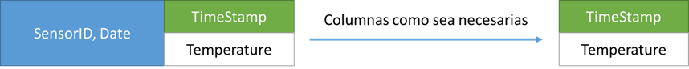
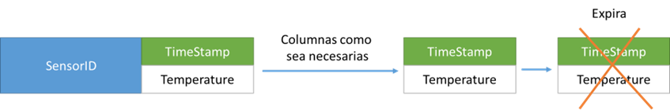
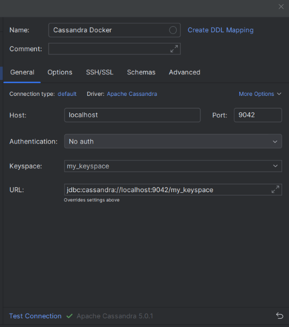

# **Caso Práctico: Sitios Web de Comercio Electrónico**

## Descripción:

El Internet de las Cosas (IoT) es un campo donde los dispositivos conectados generan y envían datos de manera continua. Estos dispositivos incluyen desde sensores en fábricas y automóviles hasta dispositivos médicos y electrodomésticos inteligentes. Todos estos dispositivos generan **flujos masivos de datos en tiempo real** que necesitan ser capturados, almacenados y analizados rápidamente para extraer información valiosa y permitir respuestas inmediatas. Este tipo de carga de trabajo plantea serios desafíos para las bases de datos tradicionales debido a la **velocidad**, **volumen** y **variedad** de los datos involucrados.

Imaginemos una **red de sensores IoT** desplegada en una planta industrial, donde se monitorean variables críticas como la temperatura, la presión, la vibración de las máquinas y la calidad del aire. Estos sensores generan miles de puntos de datos por segundo, y los administradores necesitan acceder a estos datos en tiempo real para detectar anomalías, prever fallos y realizar ajustes de manera proactiva. Los datos recientes pueden ser críticos para el análisis en tiempo real, mientras que los datos más antiguos pueden volverse irrelevantes con el tiempo.

## Solución con el Modelo Relacional de tablas:
Las bases de datos relacionales tradicionales (RDBMS), aunque útiles para muchos casos de uso, no están diseñadas para manejar este tipo de flujos de datos masivos de manera eficiente. Las bases de datos relacionales están optimizadas para **consultas ACID** (transacciones atómicas, consistentes, aisladas y duraderas) y para datos que no cambian con tanta frecuencia. En un escenario de IoT, donde los datos llegan constantemente y en gran volumen, el rendimiento de una base de datos relacional puede degradarse rápidamente.

Ejemplo: supongamos una central de monitoreo del clima regional, requiere gestionar la información que arrojan sus 1000 sensores distribuidos en diferentes zonas geográficas de la región. Si modelamos bajo un esquema relacional tendríamos la siguiente tabla y consulta:

 
Dado el volumen de información y la constante consulta de datos para el análisis y modelamiento matemático, se decide indexar por (sensorId, horaEvento). Pero esto a su vez eleva la complejidad de inserción de transmisión de datos en un BD relacional.

Ahora, supongamos que el Estado quiere integrar todas las centrales regionales de monitoreo del clima, por lo que es necesario ampliar la cantidad de servidores y replicación de datos. En otras palabras, un sistema distribuido de datos. La tabla   quedaría expresada de la siguiente manera:

Temperatura(regionId, sensorId, horaEvento, valor)

Lo cual agrega desafíos de almacenamiento replicado, indexación distribuida, consultas distribuidas, etc.

Por lo tanto:
Un sistema de base de datos relacional tradicional (RDBMS) no es suficiente cuando se trata de recuperar datos de series de tiempo de manera eficiente. La sobrecarga generada por los optimizadores de consulta y administración de transacciones no utilizados, junto con la recuperación fila por fila forzada por esquemas en estrella, no permite tiempos de respuesta eficientes. Y nuevamente, escalar un RDBMS es casi imposible. La solución son base de datos para series de tiempo (TSDB) especializados, basados en tecnologías de código abierto NoSQL, y un modelo de datos inteligente para superar dichas deficiencias. 

Otra alternativa: Apache Cassandra, el cual se considera como la base de datos de elección cuando se recopilan eventos de series de tiempo. Estos pueden ser mensajes, eventos o transacciones similares que tienen un elemento de tiempo asociado. Cassandra destaca sobre Hbase por su fácil desarrollo (CQL parecido a SQL), arquitectura simple (sin-maestro) con fácil instalación y pocos requerimientos, multi-datacenter, y mayor desempeño.   

### Solución con Bases de Datos NoSQL: Cassandra

Una base de datos **NoSQL orientada a columnas anchas** como **Apache Cassandra** es ideal para este tipo de escenarios de análisis de streaming en tiempo real. Cassandra está diseñada específicamente para manejar **escrituras y lecturas masivas con baja latencia** y para **escalar horizontalmente**, lo que permite añadir servidores fácilmente a medida que crece el volumen de datos. A continuación, explicamos las características que hacen que Cassandra sea una opción recomendada para el análisis de datos IoT en tiempo real:

#### Características Clave de Cassandra:

1. **Escalabilidad Horizontal**:
   - Cassandra se escala horizontalmente de manera sencilla, lo que significa que a medida que aumenta el número de dispositivos IoT que generan datos, solo es necesario agregar más nodos al clúster de Cassandra para distribuir la carga. Esto es fundamental en un entorno IoT, donde el volumen de datos puede crecer exponencialmente.
   - A diferencia de las bases de datos relacionales, que suelen requerir hardware más potente para manejar más carga, Cassandra puede manejar grandes volúmenes de datos distribuyéndolos en múltiples servidores, sin impacto significativo en el rendimiento.

2. **Alta Disponibilidad y Resiliencia**:
   - Cassandra está diseñada para funcionar en entornos distribuidos, donde los datos se replican en varios nodos. Esto significa que si un nodo falla, los datos aún estarán disponibles en otros nodos, garantizando una alta disponibilidad, algo crucial en un entorno IoT, donde la interrupción de servicios puede tener consecuencias graves.
   - La replicación automática de datos asegura que el sistema pueda continuar funcionando incluso durante fallos o mantenimiento.

3. **Optimización para Escrituras Masivas**:
   - Los sistemas IoT generan una enorme cantidad de datos de manera continua. Cassandra es altamente eficiente en **escrituras masivas**, ya que está diseñada para optimizar la inserción de datos a gran velocidad sin comprometer el rendimiento general del sistema.
   - En lugar de realizar operaciones complejas de bloqueo, Cassandra emplea un modelo de **consistencia eventual**, lo que significa que los datos se escriben rápidamente y se sincronizan entre los nodos de manera asíncrona, lo cual es ideal para flujos de datos en tiempo real.

4. **Modelo de Datos Basado en Columnas Anchas**:
   - En Cassandra, los datos se organizan en columnas anchas, lo que permite una **gran flexibilidad** a la hora de almacenar datos de sensores IoT. Cada fila puede contener cientos o miles de columnas, y se pueden agregar nuevas columnas sin necesidad de modificar el esquema existente, lo que facilita el almacenamiento de datos variables provenientes de diferentes sensores.
   - Esta estructura es especialmente útil en escenarios de IoT donde los datos de diferentes sensores pueden variar en tipo y frecuencia, permitiendo un almacenamiento eficiente sin necesidad de reorganizar el esquema.

5. **Baja Latencia en Consultas**:
   - Cassandra está optimizada para **consultas rápidas** y de baja latencia, lo que permite recuperar datos casi en tiempo real para realizar análisis o alertas sobre anomalías detectadas en el sistema.
   - Por ejemplo, si los datos de un sensor de temperatura superan un umbral crítico, Cassandra puede ser consultada rápidamente para obtener los últimos valores registrados, permitiendo a los administradores tomar decisiones inmediatas.

6. **Consistencia Eventual**:
   - A diferencia de las bases de datos relacionales que se basan en estrictas garantías ACID, Cassandra utiliza un enfoque de **consistencia eventual**, lo que significa que los datos pueden estar disponibles de manera rápida para las consultas, y la sincronización entre nodos se realiza en segundo plano.
   - En un sistema IoT, donde las operaciones de escritura son constantes y el sistema debe permanecer disponible incluso si algunos nodos fallan o no están completamente sincronizados, la consistencia eventual ofrece un rendimiento óptimo.

### Ejemplo de Flujo de Datos IoT en Cassandra

Imaginemos que una planta industrial está monitoreada por una red de sensores IoT que capturan datos de variables clave como la **temperatura** y la **vibración** de diferentes máquinas. Cada sensor envía miles de datos por segundo a un servidor central donde estos datos se almacenan en una base de datos Cassandra. Un modelo típico de almacenamiento en Cassandra solo para la **temperatura** podría ser algo así:


```cql
CREATE TABLE temperature ( 
    sensor_id TEXT, 
    event_time TIMESTAMP, 
    temperature DOUBLE, 
    PRIMARY KEY (sensor_id, event_time) 
); 
```
Insertamos datos: 
```cql
INSERT INTO temperature(sensor_id,event_time,temperature) 
VALUES ('1234ABCD','2018-04-03 07:01:00', 25); 
INSERT INTO temperature(sensor_id,event_time,temperature) 
VALUES ('1234ABCD','2018-04-03 07:02:00',24); 
INSERT INTO temperature(sensor_id,event_time,temperature) 
VALUES ('1234ABCD','2018-04-03 07:03:00',24); 
INSERT INTO temperature(sensor_id,event_time,temperature) 
VALUES ('1234ABCD','2018-04-03 07:04:00',25);
```

Aplicamos consulta:
```cql
SELECT temperature FROM temperature
WHERE sensor_id='1234ABCD' 
AND event_time > '2018-04-03 07:01:00' 
AND event_time < '2018-04-03 07:04:00';
```

Este modelo puede llevar tal vez a tener demasiadas columnas para una sola fila. Podemos entonces usar el siguiente modelo para distribuir la data de un mismo sensor en diferentes filas.


```cql
CREATE TABLE temperature_day ( 
sensor_id TEXT, 
date TEXT,
event_time TIMESTAMP, 
temperature DOUBLE, 
PRIMARY KEY ((sensor_id, date), event_time) 
); 
```
Insertamos datos: 
```cql
INSERT INTO temperature_day(sensor_id, date, event_time,temperature)
VALUES ('1234ABCD','2018-04-03','2018-04-03 07:01:00', 24);
INSERT INTO temperature_day(sensor_id, date, event_time,temperature)
VALUES ('1234ABCD','2018-04-03','2018-04-03 07:02:00', 25);
INSERT INTO temperature_day(sensor_id, date, event_time,temperature)
VALUES ('1234ABCD','2018-04-04','2018-04-04 07:01:00',23);
INSERT INTO temperature_day(sensor_id, date, event_time,temperature)
VALUES ('1234ABCD','2018-04-04','2018-04-04 07:02:00', 24);
```

Aplicamos consulta:
```cql
SELECT *
FROM temperature_day
WHERE sensor_id = '1234ABCD'
AND date ='2018-04-03';
```

En sistemas de series de tiempo el almacenamiento es continuo, pero en muchos casos las aplicaciones de analítica suelen desechar la información histórica después de extraer los patrones relevantes o modelos descriptivos compactos.  Por lo que los datos más antiguos ya no son útiles, entonces pueden ser eliminados eventualmente. 
Cassandra ofrece una característica llamada columnas que caducan para que nuestros datos desaparezcan silenciosamente después de una cantidad establecida de segundos.


Para gestionar este ciclo de vida de los datos en Cassandra, se puede utilizar la característica de TTL (Time to Live) para definir un tiempo de expiración de los datos.
```cql
CREATE TABLE latest_temperatures (
sensor_id text,
event_time timestamp,
temperature double,
PRIMARY KEY (sensor_id,event_time),
) WITH default_time_to_live = 2592000;  -- 30 días en segundos
```
default_time_to_live = 2592000: Define que todos los datos en esta tabla tendrán un TTL de 30 días (30 días = 30 * 24 * 60 * 60 segundos).

Insertamos datos: 
```cql
INSERT INTO latest_temperatures(sensor_id,event_time,temperature)
VALUES ('1234ABCD','2018-04-03 07:03:00',22) USING TTL 86400;
INSERT INTO latest_temperatures(sensor_id,event_time,temperature)
VALUES ('1234ABCD','2018-04-03 07:02:00',23) USING TTL 86400;
INSERT INTO latest_temperatures(sensor_id,event_time,temperature)
VALUES ('1234ABCD','2018-04-03 07:01:00', 24) USING TTL 86400;
INSERT INTO latest_temperatures(sensor_id,event_time,temperature)
VALUES ('1234ABCD','2018-04-03 07:04:00', 24) USING TTL 86400;
```
Suponiendo que queremos que las lecturas críticas de temperatura expiren después de solo 1 día (86400 segundos).


Aplicamos consulta:
```cql
SELECT *
FROM latest_temperatures
WHERE sensor_id = '1234ABCD';
```

### Conclusión:

En el caso del análisis en tiempo real de streaming de datos, especialmente en un entorno IoT, las bases de datos NoSQL como Cassandra son mucho más adecuadas que las bases de datos relacionales debido a su capacidad de escalar horizontalmente, su flexibilidad para manejar datos variables, y su alta eficiencia en la escritura y lectura de datos a gran velocidad. Cassandra permite a las empresas manejar los flujos masivos de datos que generan los dispositivos IoT sin comprometer el rendimiento, la disponibilidad o la escalabilidad.


------------
# Instalación de Cassandra en Docker

Pasos para instalar Apache Cassandra en Docker Desktop:

1. **Instalar Docker Desktop**:
   - Asegúrate de tener Docker Desktop instalado en tu máquina. Puedes descargarlo desde [Docker Desktop](https://www.docker.com/products/docker-desktop/).

2. **Obtener la imagen de Cassandra**:
   - Abre una terminal y ejecuta el siguiente comando para descargar la imagen oficial de Cassandra:
     ```bash
     docker pull cassandra
     ```
    - Si no funciona el comando, instalar directamente desde el repositorio de contenedores  
    [Docker Hub](https://www.docker.com/products/docker-desktop).

3. **Crear una red Docker**:
   - Para facilitar la comunicación entre contenedores, crea una red Docker:
     ```bash
     docker network create cassandra-network
     ```

4. **Iniciar un contenedor de Cassandra**:
   - Ejecuta el siguiente comando para iniciar un contenedor de Cassandra:
     ```bash
     docker run --name cassandra --network cassandra-network -d -p 9042:9042 cassandra:latest
     ```

5. **Verificar que el contenedor esté en funcionamiento**:
   - Usa el siguiente comando para verificar que el contenedor de Cassandra esté corriendo:
     ```bash
     docker ps
     ```

6. **Acceder a la shell de Cassandra**:
   - Para interactuar con Cassandra, puedes usar `cqlsh`. Primero, entra al contenedor:
     ```bash
     docker exec -it cassandra bash
     ```
   - Luego, inicia `cqlsh`:
     ```bash
     cqlsh
     ```
   - Si obtienes un error en la conexión, es probable cqlsh esté intentando conectarse a 127.0.0.1, cuando internamente Docker le asigno otra IP.  Para ello:
      -  Ejecuta este comando para obtener la IP del contenedo

            ```bash
            docker inspect cassandra | grep "IPAddress"
            ```
      - Usa esa IP en el comando cqlsh:
          
            cqlsh <IP_DEL_CONTENEDOR> 9042     
            cqlsh 172.18.0.2 9042     
             

7. **Crear un keyspace**:
   - Dentro de `cqlsh`, puedes crear un keyspace con el siguiente comando:
     ```sql
     CREATE KEYSPACE my_keyspace WITH REPLICATION = {
        'class': 'SimpleStrategy', 
        'replication_factor': 1};    
     ```
   - Para crear un keyspace en Apache Cassandra que incluya configuración de clúster y replicación, puedes utilizar la estrategia NetworkTopologyStrategy. Esta estrategia te permite definir la replicación en múltiples centros de datos, lo cual es útil para configuraciones de clúster distribuidos. 
   
      ```sql
     CREATE KEYSPACE my_keyspace WITH replication = {
        'class': 'NetworkTopologyStrategy',
        'datacenter1': 3,
        'datacenter2': 2 };
     ```

10. **Conectarse desde DataGrip**:
    Para conectarse desde Datagrip no se requiere autenticación, por lo tanto utilice la siguiente cadena de conexión:

    jdbc:cassandra://localhost:9042/my_keyspace

    


8. **Creación de tabla e insertar datos**:
   - Se crea una tabla y se inserta algunos datos de prueba:     
     ```sql
     USE my_keyspace;

     CREATE TABLE posts (
        id int PRIMARY KEY,
        title text,
        content text
    );

     INSERT INTO posts (id, title, content) VALUES(1,'primer post!', 'Este es mi primer post!');

     INSERT INTO posts (id, title, content) VALUES(2,'segundo post!', 'Este es mi segundo post!');
     ```

9. **Consultar los datos**:
   - Verifica los datos insertados:
     ```sql
     SELECT * FROM users;
     ```
